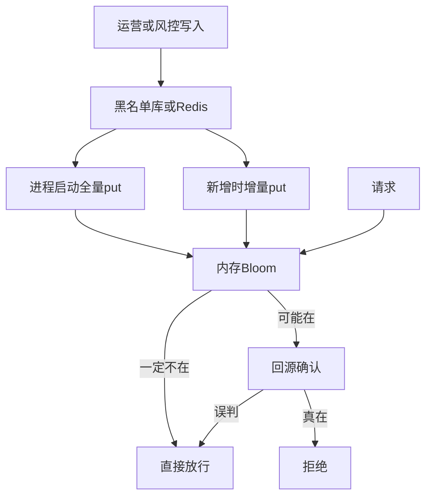

# Bloom 黑名单的常见流程

是的：通常有一个黑名单的真相源（独立服务，或业务库 / Redis），启动时把已有数据灌进内存 Bloom。但 Bloom **不是**黑名单本身，只是挡在前面的概率过滤器。

你们现在的 [`BloomFilter`](lind-algorithm-framework/src/main/java/com/lind/algorithm/bloom/BloomFilter.java) 是进程内 `BitSet`：`put` / `mightContain`，没有持久化、没有删除。适合当热路径过滤器，不能单独当黑名单库。

## 角色怎么分

- **真相源**：DB 表或 Redis Set，记录真实黑名单（用户、IP、设备、邮箱）。可增可删，重启不丢。
- **黑名单服务（可选）**：统一写入、查询、同步。小系统可以不单独拆服务，由业务进程自己读库建 Bloom。
- **内存 Bloom**：每个需要判断的进程一份（或 RedisBloom 一份共享）。只回答「可能在」或「一定不在」。

## 主流程

1. **写入**：先落库（或 Redis），成功后再 `put` 进 Bloom。多实例时，别的进程靠启动全量、定时重建，或订阅变更把新 key 补进自己的 Bloom。
2. **启动加载**：把当前有效黑名单扫进 Bloom。这是主路径，否则重启后过滤器是空的，黑名单全部失效。数据量极大时可以分批加载，或用上次持久化的位图（Redis `BF.LOADCHUNK`）恢复，避免每次扫全表。
3. **查询**（这是 Bloom 省成本的地方）：
   - `mightContain == false`：一定不在黑名单，直接放行，不打数据库。
   - `mightContain == true`：可能在，也可能是误判，必须再查真相源。确认在才拒绝。
4. **删除**：标准 Bloom 不能删单个元素。从库里删掉后，要重建 Bloom，或换可计数 Bloom / 带版本的过滤器。在重建完成前，被删的 key 仍可能被判成「可能在」，靠回源确认放行，业务仍然正确，只是多一次查询。

## 为什么不能只在启动时加载、查询只看 Bloom

误判率再低也会把正常人判进黑名单。所以命中必须回源。Bloom 的价值是：绝大多数正常请求是「一定不在」，把数据库查询挡掉。

只启动加载、运行中不 `put`，则新拉黑的 key 要等下次重启才进过滤器，这段时间每次都会打到库上（结果仍正确，因为回源能查到）。生产上是「启动全量 + 变更增量」，并定期按库重建，避免误判率随着超量插入变差。
