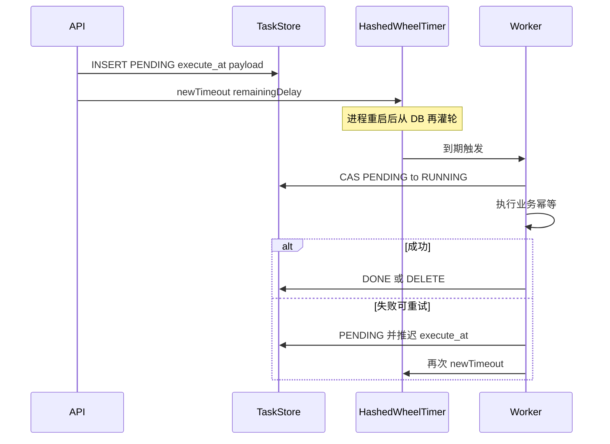

# 时间轮 + 持久化：业界做法与设计问题

## 结论先说

你们的大方向是对的：**持久化任务记录是权威数据源，时间轮只是内存加速器**——这与 [wheel/readme.md](lind-algorithm-framework/src/main/java/com/lind/algorithm/wheel/readme.md) 里已有结论一致。

需要修正的是细节：**不要在「从时间轮取出 / 即将执行」时删除持久化**，而应在**业务执行成功（或确认无需再跑）之后**再标记完成/删除，并保证幂等。

当前 [DelayTaskPlugin](lind-stream-web/src/main/java/com/lind/stream/task/DelayTaskPlugin.java) 只有内存 `bizIds`，尚无持久化层；若按「取出即删」落地，生产上会丢任务。

## 业界标准模式



| 步骤 | 业界做法 |
|---|---|
| 写入 | **先写 DB（PENDING + 绝对 `execute_at`）**，再 `newTimeout`；DB 失败则不入轮 |
| 启动 | 查 `PENDING`（及超时的 `RUNNING`），按 `execute_at - now` 灌轮；已过期的 `delay=0` 立刻触发 |
| 到期 | 先用 CAS/乐观锁把行变成 `RUNNING`（抢到才执行），再跑业务 |
| 完成 | 业务成功后 `DONE` 或物理删除；**不是**「出轮就删」 |
| 取消 | API 更新 DB 为 `CANCELLED`，并 `Timeout.cancel()`；两边都要处理 |
| 多实例 | 要么单实例跑轮，要么靠 DB CAS 抢任务，避免同一任务多机执行 |

常见存储：业务表自身状态（订单未支付）、独立 `delay_task` 表、Redis ZSET、或直接用 MQ 延迟消息（不再自建轮）。

## 你们设计里的具体问题

1. **删除时机过早（最关键）**  
   「从时间轮取出就删持久化」→ 取出后、业务跑完前进程崩溃 = **任务永久丢失**。  
   正确：出轮只表示「该触发了」；持久化要等到执行成功（或明确取消）再删/改状态。

2. **双写顺序**  
   若先入轮后写库，写库失败会出现「轮上有、库里没有」。应 **DB 成功后再入轮**；启动以 DB 为准补偿。

3. **存相对 delay 还是绝对时间**  
   必须存 **`execute_at`（绝对时间）**。重启后用 `max(0, execute_at - now)` 再调度；存「还剩 10 分钟」会在停机期间漂掉。

4. **不能只持久化轮槽**  
   Lambda/`TimerTask` 无法可靠反序列化。库里应存：`task_id`、`biz_type`、`biz_id`、`execute_at`、`payload`、`status`、`version`。到期时按 `biz_type` 分发到明确的 Handler。

5. **取消与列表**  
   仅靠轮上 `scheduledTasks()` 不够：刚写入未入轮、多实例、已出轮执行中，都应以 DB 列表为准；轮上快照只做运维辅助。

6. **多实例 / 滚动发布**  
   每台机器各自灌轮会导致重复触发。需要：**单调度实例**，或 **DB 抢锁（PENDING→RUNNING）+ 业务幂等**。

7. **失败重试**  
   执行失败若直接删库会丢单。应保留记录并更新下次 `execute_at`，或进死信；成功才 DONE。

## 推荐状态机（生产最小集）

```text
PENDING --claim--> RUNNING --ok--> DONE
   |                  |
 cancel            fail/retry
   v                  v
CANCELLED         PENDING(新 execute_at) 或 DEAD
```

- **Claim**：`UPDATE ... SET status=RUNNING WHERE id=? AND status=PENDING`（影响行数=1 才执行）
- **幂等**：业务侧用 `biz_id` 保证重复触发也安全（关单、发券等）

## 和当前代码的差距

- [HashedWheelTimer](lind-algorithm-framework/src/main/java/com/lind/algorithm/wheel/HashedWheelTimer.java)：内存调度 OK，无需改成「可持久化轮」。
- [DelayTaskPlugin](lind-stream-web/src/main/java/com/lind/stream/task/DelayTaskPlugin.java)：缺 TaskStore、启动加载、到期 claim、成功落库；`bizIds` 仅内存展示。

后续若落地，建议新增：`DelayTask` 实体 + Repository、`DelayTaskService.schedule/cancel/onFire`、`ApplicationRunner` 启动灌轮；**不要**在 `addEntry` 返回 false / 出槽时删库。

## 一句话

> 持久层管「还有没有这件事，业务程序启动时，从业务库把任务加载到时间轮」，时间轮管「什么时候把任务启动」；**删库看业务结果，业务处理成功了就可以删除记录，不看出轮动作。**
